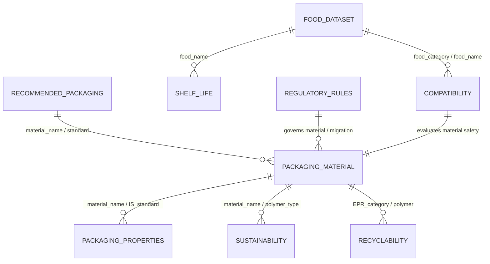

# DATASET INSPECTION REPORT
## SIH Problem Statement 26236: Smart Food-Packaging Recommendation System (SmartPack)

**Inspection Date:** September 2026
**Dataset Directory:** `Claude-DataSet/`

---

## Executive Summary of Supplied Data

A comprehensive inspection was conducted across all 15 CSV files and 2 Excel reference dictionaries supplied in the project repository.
The inspection adheres strictly to the **Non-Negotiable Rule**: No values, columns, or scientific measurements are fabricated. Technical values present in the data are cataloged as-is, and missing technical values are explicitly documented.

### Key Findings:

1. **Food Composition (`01_food_dataset.csv`):** 496 foods sourced from ICMR IFCT 2017 with exact nutritional characteristics (moisture, protein, fat, ash, dietary fiber, energy, etc.). Missing pH and exact water activity (aw), which must be estimated or requested via category bounds.
2. **Regulatory Standards (`14_recommended_packaging.csv`):** 102 rows total (93 from authoritative FSSAI Schedule IV) mapping 10 food categories to officially recommended packaging materials and forms. This serves as the primary ground truth for candidate generation and regulatory compliance.
3. **Packaging Materials & Standards (`06_packaging_material_dataset.csv`, `07_packaging_properties_dataset_Claude.csv`):** 10 packaging materials and 85 technical property specifications from BIS (Bureau of Indian Standards) standards (IS 10146, IS 10151, IS 10142, etc.). Provides tensile strength, thickness ranges, density, softening point, overall migration limits, and optical properties.
4. **Barrier Properties Reality Check (`08_barrier_properties_dataset.csv`):** Contains only 2 rows (Cellulose Film, IS 5012:1987) with WVTR. **OTR is absent across plastic materials in the raw extract.** Therefore, OTR/WVTR must be presented with full scientific transparency: real database values displayed where available, and flagged as `Data unavailable` when absent without fabricating fake numbers.
5. **Food-Packaging Compatibility (`09_food_packaging_compatibility_MERGED.csv`):** 11 curated compatibility rows (including direct ICAR experimental trials and FSSAI rules) detailing specific food-material interactions, compatibility status (Compatible vs. Incompatible), and rationale.
6. **Shelf Life & Storage Trials (`05_shelf_life_dataset.csv`, `10_packaging_shelf_life_dataset.csv`):** 26 shelf life rows and 17 measured packaging shelf-life combinations (from ICAR PHM Value-Addition trials). These provide real benchmarks for commodities like walnuts, aonla, apple, pomegranate arils, and guava in various package formats.
7. **Sustainability & Recyclability (`11_sustainability_dataset.csv`, `12_recyclability_dataset.csv`):** 11 sustainability profiles and 6 CPCB/EPR recyclability categories with EPR targets, biodegradability, and carbon footprint rankings.
8. **Regulatory Prohibitions & Quality Standards (`03_contamination_dataset.csv`, `13_regulatory_rules.csv`):** 1,359 contamination limits and 20 strict regulatory mandates (including recycling prohibitions like IS 14534 prohibiting recycled plastics for direct food contact, heavy metal migration limits under IS 9845, and mandatory printing ink restrictions).

---

## Detailed Inventory of Supplied CSV Datasets

### `01_food_dataset.csv`
- **Total Rows:** 496
- **Total Columns:** 28
- **Duplicate Rows:** 0

| Column Name | Data Type | Missing Count | Missing % | Unique Count | Sample Values |
|---|---|---:|---:|---:|---|
| `food_id` | str | 0 | 0.0% | 496 | A001, A003, A004 |
| `food_name` | str | 0 | 0.0% | 496 | Amaranth seed, black (Amaranthus cruentus), Bajra (Pennisetum typhoideum), Barley (Hordeum vulgare) |
| `food_category` | str | 0 | 0.0% | 19 | Cereals and Millets, Grain Legumes, Green Leafy Vegetables |
| `food_subcategory` | float64 | 496 | 100.0% | 0 |  |
| `commodity` | float64 | 496 | 100.0% | 0 |  |
| `scientific_name` | str | 126 | 25.4% | 245 | Amaranthus cruentus, Pennisetum typhoideum, Hordeum vulgare |
| `moisture_content` | float64 | 0 | 0.0% | 446 | 9.89, 8.97, 9.77 |
| `protein_content` | float64 | 0 | 0.0% | 419 | 14.59, 10.96, 10.94 |
| `fat_content` | float64 | 0 | 0.0% | 293 | 5.74, 5.43, 1.3 |
| `carbohydrate_content` | float64 | 220 | 44.35% | 258 | 59.98, 61.78, 61.29 |
| `fiber_content` | float64 | 220 | 44.35% | 240 | 7.02, 11.49, 15.64 |
| `ash_content` | float64 | 0 | 0.0% | 201 | 2.78, 1.37, 1.06 |
| `pH` | float64 | 496 | 100.0% | 0 |  |
| `water_activity` | float64 | 496 | 100.0% | 0 |  |
| `respiration_rate` | float64 | 496 | 100.0% | 0 |  |
| `perishability` | float64 | 496 | 100.0% | 0 |  |
| `spoilage_risk` | float64 | 496 | 100.0% | 0 |  |
| `oxidation_sensitivity` | float64 | 496 | 100.0% | 0 |  |
| `moisture_sensitivity` | float64 | 496 | 100.0% | 0 |  |
| `light_sensitivity` | float64 | 496 | 100.0% | 0 |  |
| `oxygen_sensitivity` | float64 | 496 | 100.0% | 0 |  |
| `temperature_sensitivity` | float64 | 496 | 100.0% | 0 |  |
| `microbial_risk` | float64 | 496 | 100.0% | 0 |  |
| `food_quality_grade` | float64 | 496 | 100.0% | 0 |  |
| `source` | str | 0 | 0.0% | 1 | ICMR-NIN Indian Food Composition Tables (IFCT) 2017 |
| `source_document` | str | 0 | 0.0% | 1 | Food Composition Data ICMR.pdf |
| `page_number` | int64 | 0 | 0.0% | 28 | 41, 42, 43 |
| `notes` | str | 0 | 0.0% | 457 | moisture/protein/ash/fat/energy in g or kJ per 100g edible portion (raw, except eggs); n_regions=1; energy_kJ=1490, moisture/protein/ash/fat/energy in g or kJ per 100g edible portion (raw, except eggs); n_regions=6; energy_kJ=1456, moisture/protein/ash/fat/energy in g or kJ per 100g edible portion (raw, except eggs); n_regions=6; energy_kJ=1321 |

### `02_food_quality_dataset.csv`
- **Total Rows:** 1506
- **Total Columns:** 12
- **Duplicate Rows:** 42

| Column Name | Data Type | Missing Count | Missing % | Unique Count | Sample Values |
|---|---|---:|---:|---:|---|
| `food_name` | str | 0 | 0.0% | 130 | Urd whole (Black gram), Urd or (Black gram) split (without husk), Urd or (Black gram) split (with husk) |
| `food_category` | str | 0 | 0.0% | 3 | Food grains and allied products (pulses), Spices and condiments, Fruits and Vegetables |
| `food_subcategory` | float64 | 1506 | 100.0% | 0 |  |
| `quality_parameter` | str | 0 | 0.0% | 9 | Moisture, Foreign_matter_organic, Foreign_matter_inorganic |
| `grade` | str | 7 | 0.46% | 15 | Special, Standard, General |
| `minimum_requirement` | float64 | 1499 | 99.54% | 7 | 23.0, 20.0, 53.0 |
| `maximum_requirement` | float64 | 171 | 11.35% | 86 | 11.0, 0.1, 0.05 |
| `acceptable_range` | str | 1342 | 89.11% | 157 | (i) Grapes must be of superior quality and the, (i) Grapes must be of good quality and the, (i) The bunches may show defects in |
| `unit` | str | 0 | 0.0% | 3 | % by weight (max, unless noted), qualitative, mm |
| `source` | str | 0 | 0.0% | 1 | AGMARK / Directorate of Marketing & Inspection |
| `source_document` | str | 0 | 0.0% | 3 | Volume-7 (Food grains and allied products Compendium)-AGMARK.pdf, Volume-9 (Spices and condiments Compendium)-AGMARK.pdf, Volume-5 (Fruits and Vegetables Compendium)-AGMARK.pdf |
| `page_number` | int64 | 0 | 0.0% | 97 | 7, 8, 9 |

### `03_contamination_dataset.csv`
- **Total Rows:** 1359
- **Total Columns:** 11
- **Duplicate Rows:** 4

| Column Name | Data Type | Missing Count | Missing % | Unique Count | Sample Values |
|---|---|---:|---:|---:|---|
| `food_name` | str | 0 | 0.0% | 460 | Agar, Alginic acid, All types of sugars, sugar syrup, invert sugar and direct consumption coloured sugars with sulphated ash content exceeding 1.0 percent Alumina used in preparation of lake colour |
| `food_category` | float64 | 1359 | 100.0% | 0 |  |
| `contaminant` | str | 0 | 0.0% | 239 | Lead, Copper, Arsenic |
| `contaminant_type` | str | 0 | 0.0% | 9 | Heavy metal, Mycotoxin, Natural toxin |
| `maximum_permitted_limit` | str | 0 | 0.0% | 67 | 5.0, 10, 2.0 |
| `unit` | str | 0 | 0.0% | 7 | mg/kg or mg/L (ppm), µg/kg, ppm |
| `applicable_food` | str | 0 | 0.0% | 460 | Agar, Alginic acid, All types of sugars, sugar syrup, invert sugar and direct consumption coloured sugars with sulphated ash content exceeding 1.0 percent Alumina used in preparation of lake colour |
| `regulatory_requirement` | str | 0 | 0.0% | 2 | FSSAI (Contaminants, Toxins and Residues) Regulations, 2011 - Version VI (27.01.2022), FSSAI (Contaminants, Toxins and Residues) Regulations, 2011 - Version VI (27.01.2022); 2.5.1 marine biotoxins |
| `source` | str | 0 | 0.0% | 1 | FSSAI |
| `source_document` | str | 0 | 0.0% | 1 | Compendium_Contaminants_Regulations_28_01_2022-FSSAI.pdf |
| `page_number` | float64 | 1 | 0.07% | 41 | 1.0, 2.0, 3.0 |

### `04_storage_dataset.csv`
- **Total Rows:** 8
- **Total Columns:** 16
- **Duplicate Rows:** 0

| Column Name | Data Type | Missing Count | Missing % | Unique Count | Sample Values |
|---|---|---:|---:|---:|---|
| `food_name` | str | 0 | 0.0% | 8 | Fish/fish products (general, chilled), Fish/fish products (general, frozen), Ground meat/meat emulsion |
| `storage_type` | str | 0 | 0.0% | 7 | Refrigerated/chilled, Frozen, Modified atmosphere cold storage |
| `recommended_temperature_min` | float64 | 2 | 25.0% | 5 | 3.0, -22.0, -2.0 |
| `recommended_temperature_max` | float64 | 2 | 25.0% | 5 | 7.0, -18.0, 0.0 |
| `temperature_unit` | str | 2 | 25.0% | 1 | C |
| `relative_humidity_min` | float64 | 8 | 100.0% | 0 |  |
| `relative_humidity_max` | float64 | 8 | 100.0% | 0 |  |
| `atmosphere_requirement` | str | 6 | 75.0% | 2 | 70% O2 / 20% CO2 / 10% N2, Modified atmosphere (selectively permeable film) |
| `oxygen_requirement` | str | 7 | 87.5% | 1 | High oxygen (colour stabilization) |
| `light_requirement` | float64 | 8 | 100.0% | 0 |  |
| `ventilation_requirement` | float64 | 8 | 100.0% | 0 |  |
| `storage_duration` | str | 2 | 25.0% | 6 | Days to weeks, Weeks to months, Up to 15 days |
| `storage_condition_description` | str | 0 | 0.0% | 8 | Chilling condition used across ICAR fish-preservation trials (5±2°C typical), Freezing condition (-20±2°C typical) used in ICAR fish trials, MAP composition for ground buffalo meat |
| `source` | str | 0 | 0.0% | 3 | ICAR-DARE Annual Report 2011-12, AGMARK Volume-7 (Food grains Compendium), Bureau of Indian Standards (BIS) |
| `source_document` | str | 0 | 0.0% | 3 | PHM-Value-addtion-AR-2011-12_0-ICAR.pdf, Volume-7 (Food grains and allied products Compendium)-AGMARK.pdf, BIS Food Packaging Handbook.pdf |
| `page_number` | str | 0 | 0.0% | 4 | 3, 4, various |

### `05_shelf_life_dataset.csv`
- **Total Rows:** 26
- **Total Columns:** 18
- **Duplicate Rows:** 0

| Column Name | Data Type | Missing Count | Missing % | Unique Count | Sample Values |
|---|---|---:|---:|---:|---|
| `food_name` | str | 0 | 0.0% | 20 | Soy butter, Soy paneer (tofu), untreated, Soy paneer (tofu), treated |
| `food_category` | str | 0 | 0.0% | 12 | Processed food (nut/legume butter), Dairy/soy analogue, Marine/freshwater fish |
| `packaging_material` | str | 7 | 26.92% | 14 | None (fresh), Retortable pouch, PE, PP, laminated PP (evaluated) |
| `packaging_type` | str | 7 | 26.92% | 14 | Ambient storage, Refrigerated, Retort pouch |
| `storage_temperature` | str | 3 | 11.54% | 7 | Ambient, 5, -20 |
| `temperature_unit` | str | 3 | 11.54% | 1 | C |
| `relative_humidity` | float64 | 26 | 100.0% | 0 |  |
| `atmosphere` | str | 10 | 38.46% | 8 | Aerobic, Sealed/autoclaved, Chilled |
| `storage_condition` | str | 0 | 0.0% | 24 | Ambient, Refrigerated, Ambient, untreated |
| `initial_quality` | float64 | 26 | 100.0% | 0 |  |
| `shelf_life_value` | str | 0 | 0.0% | 14 | 45, 60, 3-4 |
| `shelf_life_unit` | str | 0 | 0.0% | 6 | days, hours, month |
| `shelf_life_min` | float64 | 25 | 96.15% | 1 | 3.0 |
| `shelf_life_max` | float64 | 25 | 96.15% | 1 | 4.0 |
| `observed_quality_change` | str | 8 | 30.77% | 18 | No artificial preservatives; comparable to peanut butter, Poor keeping quality, Extended via retort processing |
| `source` | str | 0 | 0.0% | 1 | ICAR-DARE Annual Report 2011-12 (Post-Harvest Management and Value-Addition) |
| `source_document` | str | 0 | 0.0% | 1 | PHM-Value-addtion-AR-2011-12_0-ICAR.pdf |
| `page_number` | int64 | 0 | 0.0% | 4 | 3, 4, 5 |

### `06_packaging_material_dataset.csv`
- **Total Rows:** 26
- **Total Columns:** 21
- **Duplicate Rows:** 0

| Column Name | Data Type | Missing Count | Missing % | Unique Count | Sample Values |
|---|---|---:|---:|---:|---|
| `packaging_id` | str | 0 | 0.0% | 26 | PKG-001, PKG-002, PKG-003 |
| `material_name` | str | 0 | 0.0% | 26 | PET, HDPE, LDPE/PE |
| `material_family` | str | 0 | 0.0% | 11 | Plastic, Paper, Glass |
| `material_type` | str | 0 | 0.0% | 26 | Polyalkylene terephthalate, High-density polyethylene, Polyethylene |
| `primary_or_secondary_packaging` | str | 0 | 0.0% | 9 | Primary (when in direct food-contact application specified by FSSAI), Primary or secondary, Primary/secondary (cartons) |
| `rigid_or_flexible` | str | 16 | 61.54% | 4 | Flexible, Semi-rigid, Rigid (structural board) |
| `food_contact_suitable` | str | 0 | 0.0% | 11 | Yes, Yes (general packing/wrapping; food-contact per Table 2 contaminant limits), Yes (for food cartons, subject to general food-contact provisions) |
| `temperature_range` | str | 16 | 61.54% | 3 | Ambient, Wide range (foil is heat/light/gas barrier), Ambient (dry storage) |
| `heat_sealability` | str | 17 | 65.38% | 9 | Not heat-sealable (uncoated), Not inherently heat-sealable (needs coating/adhesive), Becomes heat-sealable after wax coating |
| `strength` | str | 16 | 61.54% | 8 | See Dataset 7 (burst/tear/tensile index), Table 1 (IS 1776) - values not machine-extractable (scanned table), See Dataset 7 |
| `flexibility` | str | 16 | 61.54% | 9 | Flexible sheet/roll, Foldable board, Flexible sheet |
| `transparency` | str | 16 | 61.54% | 6 | Opaque (unbleached), Printable surface, opaque, Translucent after waxing |
| `reusability` | str | 16 | 61.54% | 8 | Reusable (sacks) depending on grade, No (single-use carton typical), No |
| `recyclability` | str | 16 | 61.54% | 9 | Recyclable (paper stream), Recyclable (paperboard stream), Recyclable (uncoated paper) / waxed paper recycling limited |
| `compostability` | str | 16 | 61.54% | 5 | Compostable (uncoated paper), Compostable (uncoated), Compostable (cellulose-based) |
| `biodegradability` | str | 16 | 61.54% | 2 | Biodegradable, Not readily biodegradable |
| `recycled_content_possible` | str | 16 | 61.54% | 9 | Grade 2/3 made from waste paper/agri-residue (recycled content), Possible (recycled paperboard grades exist), Not specified |
| `source` | str | 0 | 0.0% | 2 | FSSAI, Bureau of Indian Standards (BIS) - Handbook on Sustainable Packaging |
| `source_document` | str | 0 | 0.0% | 2 | FSSAI Packaging Regulations.pdf, BIS Food Packaging Handbook.pdf |
| `page_number` | int64 | 0 | 0.0% | 12 | 6, 7, 8 |
| `notes` | str | 16 | 61.54% | 10 | Grade 1=virgin kraft, Grade 2=agri-residue/semi-virgin, Grade 3=100% waste paper, Numeric requirement table present in source but not machine-extractable (bordered table lost in text extraction), Standard explicitly states it does NOT apply to food wrapping paper (see scope 1.1) |

### `07_packaging_properties_dataset_Claude.csv`
- **Total Rows:** 85
- **Total Columns:** 12
- **Duplicate Rows:** 0

| Column Name | Data Type | Missing Count | Missing % | Unique Count | Sample Values |
|---|---|---:|---:|---:|---|
| `material_name` | str | 0 | 0.0% | 16 | Kraft Paper Grade 1 (IS 1397:2020), Kraft Paper Grade 2 (IS 1397:2020), Kraft Paper Grade 3 (IS 1397:2020) |
| `property_name` | str | 0 | 0.0% | 30 | Moisture content, pH, Burst index |
| `property_value` | str | 0 | 0.0% | 57 | 9, 5.5, 2.45 |
| `unit` | str | 0 | 0.0% | 18 | %, -, kPa.m2/g |
| `test_condition` | str | 0 | 0.0% | 11 | Max, as received, Min, Min, each direction |
| `thickness` | float64 | 85 | 100.0% | 0 |  |
| `temperature` | str | 80 | 94.12% | 1 | 27°C |
| `relative_humidity` | str | 83 | 97.65% | 1 | 65% |
| `source` | str | 0 | 0.0% | 1 | Bureau of Indian Standards (BIS) Handbook |
| `source_document` | str | 0 | 0.0% | 1 | BIS Food Packaging Handbook.pdf |
| `page_number` | int64 | 0 | 0.0% | 7 | 8, 65, 91 |
| `notes` | float64 | 85 | 100.0% | 0 |  |

### `08_barrier_properties_dataset.csv`
- **Total Rows:** 2
- **Total Columns:** 21
- **Duplicate Rows:** 0

| Column Name | Data Type | Missing Count | Missing % | Unique Count | Sample Values |
|---|---|---:|---:|---:|---|
| `material_name` | str | 0 | 0.0% | 1 | Cellulose Film Grade 300 (coated), IS 5012:1987 |
| `material_structure` | str | 0 | 0.0% | 2 | Regenerated cellulose, coated (creased), Regenerated cellulose, coated (uncreased) |
| `thickness` | float64 | 2 | 100.0% | 0 |  |
| `oxygen_transmission_rate` | float64 | 2 | 100.0% | 0 |  |
| `otr_unit` | float64 | 2 | 100.0% | 0 |  |
| `water_vapour_transmission_rate` | int64 | 0 | 0.0% | 2 | 30, 15 |
| `wvtr_unit` | str | 0 | 0.0% | 1 | g/m2/24h |
| `carbon_dioxide_transmission_rate` | float64 | 2 | 100.0% | 0 |  |
| `co2tr_unit` | float64 | 2 | 100.0% | 0 |  |
| `light_barrier` | float64 | 2 | 100.0% | 0 |  |
| `uv_barrier` | float64 | 2 | 100.0% | 0 |  |
| `moisture_barrier` | str | 1 | 50.0% | 1 | Qualitative only - no numeric barrier rating in source |
| `oxygen_barrier` | float64 | 2 | 100.0% | 0 |  |
| `aroma_barrier` | float64 | 2 | 100.0% | 0 |  |
| `barrier_rating` | float64 | 2 | 100.0% | 0 |  |
| `test_temperature` | int64 | 0 | 0.0% | 1 | 38 |
| `test_relative_humidity` | int64 | 0 | 0.0% | 1 | 90 |
| `source` | str | 0 | 0.0% | 1 | Bureau of Indian Standards (BIS) Handbook |
| `source_document` | str | 0 | 0.0% | 1 | BIS Food Packaging Handbook.pdf |
| `page_number` | int64 | 0 | 0.0% | 1 | 91 |
| `notes` | str | 0 | 0.0% | 2 | Water vapour permeability at 38°C, 90±2% RH, 24h; "creased" sample condition, Uncreated sample condition; lower WVTR than creased sample (creasing damages barrier coating) |

### `09_food_packaging_compatibility_MERGED.csv`
- **Total Rows:** 50
- **Total Columns:** 18
- **Duplicate Rows:** 0

| Column Name | Data Type | Missing Count | Missing % | Unique Count | Sample Values |
|---|---|---:|---:|---:|---|
| `food_name` | str | 45 | 90.0% | 4 | Ready-to-eat/cook fish patties, Processed cheese with oats, Foodgrains (wheat, rice, pulses) |
| `food_category` | str | 0 | 0.0% | 13 | Milk and milk products, Fats, oils and fat emulsions, Fruit & Vegetable products |
| `packaging_material` | str | 0 | 0.0% | 27 | Glass, PET, HDPE |
| `packaging_type` | str | 0 | 0.0% | 40 | Glass bottle with metal caps or PP/HDPE caps, Rigid PET container with PP/HDPE caps, Rigid HDPE container with PP/HDPE caps |
| `compatibility` | str | 0 | 0.0% | 4 | FSSAI Schedule IV suggestive packaging, Compatible, Less compatible (vs tub) |
| `compatibility_reason` | str | 0 | 0.0% | 6 | Listed as a suggestive packaging material for the product category in FSSAI Packaging Regulations, Most suitable among PE/PP/laminated-PP tested for vacuum and MAP of fish products, Higher free-fatty-acid increase (lipid oxidation) observed in pouch vs tub during storage |
| `moisture_protection_required` | str | 45 | 90.0% | 3 | Yes, Not specified, Yes (moisture regain control) |
| `oxygen_protection_required` | str | 45 | 90.0% | 2 | Yes (MAP), Not specified |
| `light_protection_required` | str | 45 | 90.0% | 1 | Not specified |
| `fat_compatibility` | str | 45 | 90.0% | 4 | Not specified, Concern (fat migration/oxidation observed), Better than pouch |
| `acid_compatibility` | str | 45 | 90.0% | 2 | Not specified, Not applicable |
| `chemical_compatibility` | str | 45 | 90.0% | 1 | Not specified |
| `migration_concern` | str | 45 | 90.0% | 3 | Not specified in source, Free fatty acid increase noted (0.257% pouch vs 0.212% tub), Not specified |
| `recommended` | str | 0 | 0.0% | 3 | Yes, True, False |
| `not_recommended` | float64 | 45 | 90.0% | 2 | 0.0, 1.0 |
| `source` | str | 0 | 0.0% | 2 | FSSAI, ICAR-DARE Annual Report 2011-12 / BIS Handbook |
| `source_document` | str | 0 | 0.0% | 4 | FSSAI Packaging Regulations.pdf, PHM-Value-addtion-AR-2011-12_0-ICAR.pdf, BIS Food Packaging Handbook.pdf / AGMARK Volume-7 |
| `page_number` | int64 | 0 | 0.0% | 6 | 9, 10, 3 |

### `10_packaging_shelf_life_dataset.csv`
- **Total Rows:** 17
- **Total Columns:** 19
- **Duplicate Rows:** 0

| Column Name | Data Type | Missing Count | Missing % | Unique Count | Sample Values |
|---|---|---:|---:|---:|---|
| `record_id` | str | 0 | 0.0% | 17 | R001, R002, R003 |
| `food_name` | str | 0 | 0.0% | 14 | Soy paneer (tofu), Rohu/Catla fish patties (ready-to-eat/cook), Fish cut-up parts/fingers/chunks/nuggets |
| `food_category` | str | 0 | 0.0% | 10 | Dairy/soy analogue, Marine/freshwater fish, Fruit |
| `packaging_material` | str | 0 | 0.0% | 13 | Retortable pouch (polymer laminate), Laminated Polypropylene (PP), Polypropylene (rigid) with lid |
| `packaging_structure` | str | 0 | 0.0% | 11 | Pouch, autoclaved, Vacuum pack, MAP film |
| `packaging_type` | str | 0 | 0.0% | 13 | Retort pouch, Vacuum, MAP |
| `packaging_thickness` | str | 12 | 70.59% | 4 | 500 micron, 200 gauge, 25 micron |
| `storage_temperature` | str | 3 | 17.65% | 8 | Ambient, 5, -20 |
| `temperature_unit` | str | 3 | 17.65% | 1 | C |
| `relative_humidity` | float64 | 17 | 100.0% | 0 |  |
| `atmosphere` | str | 0 | 0.0% | 12 | Sealed/sterile, Vacuum, Modified atmosphere |
| `initial_food_condition` | str | 0 | 0.0% | 13 | Autoclaved after packing, Spice mix + probiotic treated, Fresh cut |
| `shelf_life` | float64 | 1 | 5.88% | 8 | 18.0, 45.0, 3.0 |
| `shelf_life_unit` | str | 0 | 0.0% | 5 | days, months, weeks |
| `quality_change` | str | 0 | 0.0% | 15 | Extended keeping quality vs 3-4h unpackaged baseline, Extended vs 4-day refrigerated baseline, Enhanced keeping quality during chilled/frozen storage |
| `shelf_life_extension` | str | 13 | 76.47% | 4 | 15x (ambient) vs untreated baseline, ~11x vs untreated baseline, Most suitable of PE/PP/laminated-PP tested |
| `source` | str | 0 | 0.0% | 1 | ICAR-DARE Annual Report 2011-12 |
| `source_document` | str | 0 | 0.0% | 1 | PHM-Value-addtion-AR-2011-12_0-ICAR.pdf |
| `page_number` | int64 | 0 | 0.0% | 4 | 3, 4, 5 |

### `11_sustainability_dataset.csv`
- **Total Rows:** 11
- **Total Columns:** 16
- **Duplicate Rows:** 0

| Column Name | Data Type | Missing Count | Missing % | Unique Count | Sample Values |
|---|---|---:|---:|---:|---|
| `material_name` | str | 0 | 0.0% | 11 | Kraft Paper (IS 1397:2020), Folding Box Board (IS 1776:1989), Cellulose Film (IS 5012:1987) |
| `recyclable` | str | 0 | 0.0% | 9 | Yes, Limited (compostable stream preferred), Difficult (multi-material laminate) |
| `reusable` | str | 0 | 0.0% | 9 | Yes (sacks), Limited (single-use carton typical), No (single-use) |
| `compostable` | str | 0 | 0.0% | 6 | Yes (uncoated), Yes (cellulose-based), Yes |
| `biodegradable` | str | 0 | 0.0% | 3 | Yes, No, Yes (under industrial composting conditions) |
| `recycled_content_possible` | str | 0 | 0.0% | 11 | Yes (Grade 2/3 from waste paper/agri-residue), Yes (recycled paperboard grades exist), No |
| `renewable_resource` | str | 0 | 0.0% | 8 | Yes (wood pulp/agri-residue), Yes, Yes (regenerated cellulose from wood pulp) |
| `plastic_content` | str | 0 | 0.0% | 5 | No, No (paper-foil, but often laminated with plastic/adhesive), Yes (100%) |
| `material_type` | str | 0 | 0.0% | 8 | Paper, Paperboard, Regenerated cellulose |
| `end_of_life_option` | str | 0 | 0.0% | 8 | Recycling, composting, Composting, Energy recovery / difficult mechanical recycling |
| `waste_management_route` | str | 0 | 0.0% | 11 | Paper recycling stream / composting, Paperboard/cardboard recycling stream, Compostable waste stream |
| `environmental_advantages` | str | 0 | 0.0% | 11 | Renewable fibre source, biodegradable, ECO Mark variant requires recyclable/reusable/biodegradable secondary packaging, Recyclable, biodegradable, Biodegradable, plant-derived |
| `environmental_concerns` | str | 1 | 9.09% | 10 | Virgin grade (Grade 1) relies on wood pulp; coatings/waxing can reduce recyclability, Coated or laminated variants harder to recycle, Coatings for barrier properties may reduce compostability |
| `source` | str | 0 | 0.0% | 1 | BIS / CPCB / MoEFCC |
| `source_document` | str | 0 | 0.0% | 2 | BIS Food Packaging Handbook.pdf, MoEFCC_Plastic_Waste_Management_Rules.pdf |
| `page_number` | int64 | 0 | 0.0% | 10 | 8, 41, 91 |

### `12_recyclability_dataset.csv`
- **Total Rows:** 6
- **Total Columns:** 13
- **Duplicate Rows:** 0

| Column Name | Data Type | Missing Count | Missing % | Unique Count | Sample Values |
|---|---|---:|---:|---:|---|
| `material_name` | str | 0 | 0.0% | 6 | Rigid plastic (PET, HDPE, PP, PS containers/bottles/jars), Flexible plastic - single or multilayer (pouches, sachets, carry bags, plastic sheets), Multilayered plastic packaging (≥1 plastic layer + ≥1 non-plastic layer) |
| `packaging_structure` | str | 0 | 0.0% | 6 | Single-material rigid container, Flexible film/pouch/carry bag, Multilayer laminate |
| `recyclable` | str | 0 | 0.0% | 5 | Yes, Yes (single-layer); Limited (multilayer of different resins), Difficult / only if technically recyclable |
| `recycling_category` | str | 0 | 0.0% | 6 | Rigid plastic, Flexible plastic, Multilayered plastic (MLP) |
| `recycling_route` | str | 0 | 0.0% | 6 | Mechanical recycling per IS 14534:1998, Mechanical recycling (single-layer) / limited options for multilayer, Energy recovery, co-processing in cement kilns, or road construction (per Indian Road Congress guidelines) if non-recyclable |
| `recycling_requirement` | str | 0 | 0.0% | 6 | Recycling shall conform to IS 14534:1998 Guidelines for Recycling of Plastics, Recycling shall conform to IS 14534:1998; carry bags min. 50 micron thickness, Non-recyclable MLP to be phased out within 2 years of rule notification |
| `collection_requirement` | str | 0 | 0.0% | 5 | Producer/Brand Owner must register on CPCB EPR portal; collection via registered PWP/ULBs, Producer/Brand Owner must register on CPCB EPR portal, Certified compostable bags must bear certificate number |
| `epr_category` | str | 0 | 0.0% | 5 | Category I, Category II, Category III |
| `recycled_content_requirement` | str | 0 | 0.0% | 6 | Not separately specified in source for rigid category, Not separately specified, Not specified |
| `end_of_life` | str | 0 | 0.0% | 6 | Mechanical recycling, Mechanical recycling or energy recovery, Energy recovery / phase-out of non-recyclable types |
| `source` | str | 0 | 0.0% | 3 | CPCB, MoEFCC, BIS |
| `source_document` | str | 0 | 0.0% | 3 | CPCB Plastic Waste Management SOP.pdf, MoEFCC_Plastic_Waste_Management_Rules.pdf, BIS Food Packaging Handbook.pdf |
| `page_number` | int64 | 0 | 0.0% | 5 | 30, 23, 25 |

### `13_regulatory_rules.csv`
- **Total Rows:** 20
- **Total Columns:** 16
- **Duplicate Rows:** 0

| Column Name | Data Type | Missing Count | Missing % | Unique Count | Sample Values |
|---|---|---:|---:|---:|---|
| `rule_id` | str | 0 | 0.0% | 20 | RG001, RG002, RG003 |
| `food_category` | str | 0 | 0.0% | 8 | All food categories, Drinking water (packaged/mineral), Paper and board (food contact) |
| `packaging_material` | str | 0 | 0.0% | 18 | Any packaging material, Plastic (general), Recycled plastics |
| `packaging_type` | str | 0 | 0.0% | 2 | Primary/secondary, Primary |
| `requirement` | str | 2 | 10.0% | 18 | Material in direct food contact must be food-grade quality and comply with FSS (Packaging) Regulations 2018, Overall migration limit of 60 mg/kg or 10 mg/dm2 (tested per IS 9845), no visible colour migration, Specific migration limits for metals: Barium 1.0, Cobalt 0.05, Copper 5.0, Iron 48.0, Lithium 0.6, Manganese 0.6, Zinc 25.0 (mg/kg) |
| `restriction` | str | 12 | 60.0% | 8 | Exceeding migration limit, Recycled plastics (incl. carry bags) shall not be used for packaging, storing, carrying or dispensing food, Reuse of tin containers |
| `permitted` | str | 13 | 65.0% | 7 | Yes, if food-grade & compliant, Yes, listed resins conforming to respective IS, Single use only |
| `prohibited` | str | 5 | 25.0% | 15 | Non-food-grade material for direct contact, Non-compliant plastic packaging, Exceeding specific migration limits |
| `migration_requirement` | str | 18 | 90.0% | 2 | 60 mg/kg or 10 mg/dm2 (IS 9845), See requirement (mg/kg per substance) |
| `food_contact_requirement` | str | 14 | 70.0% | 5 | Must be food grade quality, Not permitted for food contact, Food grade per respective IS |
| `labelling_requirement` | str | 14 | 70.0% | 6 | Mandatory: Name of food, ingredient list, net quantity, mfg/best-before date, FSSAI license no., manufacturer address, Storage condition and best-before/expiry declaration, Producer registration number to be printed on packaging |
| `regulation_type` | str | 0 | 0.0% | 5 | Packaging regulation, Labelling regulation, EPR/Recycling regulation |
| `regulation_name` | str | 0 | 0.0% | 18 | FSS (Packaging) Regulations, 2018, FSS (Packaging) Regulations, 2018 - Reg 4(4)(b), FSS (Packaging) Regulations, 2018 - Table 1 |
| `source` | str | 0 | 0.0% | 1 | FSSAI / BIS / CPCB / MoEFCC |
| `source_document` | str | 0 | 0.0% | 4 | FSSAI_Packaging_Regulations.pdf, Download the official FSSAI Labelling & Display Compendium PDF.pdf, CPCB Plastic Waste Management SOP.pdf |
| `page_number` | int64 | 0 | 0.0% | 11 | 1, 5, 6 |

### `14_recommended_packaging.csv`
- **Total Rows:** 102
- **Total Columns:** 13
- **Duplicate Rows:** 0

| Column Name | Data Type | Missing Count | Missing % | Unique Count | Sample Values |
|---|---|---:|---:|---:|---|
| `food_name` | str | 0 | 0.0% | 19 | Ready-to-eat/cook fish patties (rohu/catla), Fish cut-up parts, fingers, chunks, nuggets, Mango (for ripening/transport) |
| `food_category` | str | 0 | 0.0% | 17 | Marine/freshwater fish, Fruit, Dairy |
| `recommended_packaging_material` | str | 0 | 0.0% | 85 | Laminated Polypropylene (PP), Polypropylene (rigid, 500 micron) with lid, Corrugated Fibreboard (CFB) box, inner-lined with flexible film (all sides except top) |
| `recommended_packaging_type` | str | 93 | 91.18% | 9 | Vacuum pack / MAP, Rigid container with lid, Box with film liner |
| `recommended_packaging_structure` | str | 93 | 91.18% | 8 | Multilayer laminate, Rigid tub, CFB box + film liner |
| `storage_condition` | str | 93 | 91.18% | 9 | Chilled or frozen, Chilled (7 days) / Frozen (3 months), Room temperature |
| `expected_shelf_life` | str | 93 | 91.18% | 9 | Up to 3 months, 7 days chilled / 3 months frozen, Reduced weight loss by 50% during ripening |
| `reason` | str | 0 | 0.0% | 10 | Found most suitable of PE/PP/laminated-PP tested for vacuum packaging and MAP; best kept quality, Maintained hygienic and keeping quality, Reduces weight loss/moisture loss during ripening |
| `sustainability_information` | str | 93 | 91.18% | 5 | Not specified in source, Not specified, CFB is recyclable/compostable (paperboard) |
| `recyclability_information` | str | 93 | 91.18% | 9 | Multilayer plastic laminate - not readily recyclable (mixed material), PP is recyclable (resin code 5) if collected separately, CFB recyclable in cardboard stream |
| `source` | str | 0 | 0.0% | 2 | ICAR-DARE Annual Report 2011-12, FSSAI |
| `source_document` | str | 0 | 0.0% | 3 | PHM-Value-addtion-AR-2011-12_0-ICAR.pdf, BIS Food Packaging Handbook.pdf, FSSAI_Packaging_Regulations.pdf |
| `page_number` | int64 | 0 | 0.0% | 9 | 3, 4, 6 |

### `15_MASTER_ML_DATASET.csv`
- **Total Rows:** 17
- **Total Columns:** 34
- **Duplicate Rows:** 0

| Column Name | Data Type | Missing Count | Missing % | Unique Count | Sample Values |
|---|---|---:|---:|---:|---|
| `food_name` | str | 0 | 0.0% | 14 | Soy paneer (tofu), Rohu/Catla fish patties (ready-to-eat/cook), Fish cut-up parts/fingers/chunks/nuggets |
| `food_category` | str | 0 | 0.0% | 10 | Dairy/soy analogue, Marine/freshwater fish, Fruit |
| `moisture_content` | float64 | 17 | 100.0% | 0 |  |
| `fat_content` | float64 | 17 | 100.0% | 0 |  |
| `protein_content` | float64 | 17 | 100.0% | 0 |  |
| `pH` | float64 | 17 | 100.0% | 0 |  |
| `water_activity` | float64 | 17 | 100.0% | 0 |  |
| `perishability` | float64 | 17 | 100.0% | 0 |  |
| `moisture_sensitivity` | float64 | 17 | 100.0% | 0 |  |
| `oxygen_sensitivity` | float64 | 17 | 100.0% | 0 |  |
| `light_sensitivity` | float64 | 17 | 100.0% | 0 |  |
| `microbial_risk` | float64 | 17 | 100.0% | 0 |  |
| `storage_temperature` | str | 3 | 17.65% | 8 | Ambient, 5, -20 |
| `relative_humidity` | float64 | 17 | 100.0% | 0 |  |
| `atmosphere` | str | 0 | 0.0% | 12 | Sealed/sterile, Vacuum, Modified atmosphere |
| `packaging_material` | str | 0 | 0.0% | 13 | Retortable pouch (polymer laminate), Laminated Polypropylene (PP), Polypropylene (rigid) with lid |
| `packaging_type` | str | 0 | 0.0% | 13 | Retort pouch, Vacuum, MAP |
| `thickness` | str | 12 | 70.59% | 4 | 500 micron, 200 gauge, 25 micron |
| `OTR` | float64 | 17 | 100.0% | 0 |  |
| `WVTR` | float64 | 17 | 100.0% | 0 |  |
| `moisture_barrier` | float64 | 17 | 100.0% | 0 |  |
| `oxygen_barrier` | float64 | 17 | 100.0% | 0 |  |
| `light_barrier` | float64 | 17 | 100.0% | 0 |  |
| `strength` | float64 | 17 | 100.0% | 0 |  |
| `heat_sealability` | float64 | 17 | 100.0% | 0 |  |
| `food_packaging_compatibility` | float64 | 17 | 100.0% | 0 |  |
| `shelf_life` | float64 | 1 | 5.88% | 8 | 18.0, 45.0, 3.0 |
| `shelf_life_unit` | str | 0 | 0.0% | 5 | days, months, weeks |
| `recyclable` | float64 | 17 | 100.0% | 0 |  |
| `reusable` | float64 | 17 | 100.0% | 0 |  |
| `compostable` | float64 | 17 | 100.0% | 0 |  |
| `biodegradable` | float64 | 17 | 100.0% | 0 |  |
| `recommended` | int64 | 0 | 0.0% | 1 | 1 |
| `source` | str | 0 | 0.0% | 4 | ICAR-DARE Annual Report 2011-12 / PHM-Value-addtion-AR-2011-12_0-ICAR.pdf (p.3), ICAR-DARE Annual Report 2011-12 / PHM-Value-addtion-AR-2011-12_0-ICAR.pdf (p.4), ICAR-DARE Annual Report 2011-12 / PHM-Value-addtion-AR-2011-12_0-ICAR.pdf (p.5) |

---

## Excel Reference Dictionaries

### `DATA_DICTIONARY.xlsx`
- **Sheet:** `Data Dictionary` (32 rows)
- **Headers:** column_name, meaning, unit, data_type, source, whether_ML_feature, whether_target

### `DATA_SOURCE_MAPPING.xlsx`
- **Sheet:** `Source Mapping` (15 rows)
- **Headers:** source_document, total_pages, dataset(s), pages_used, data_extracted_summary

---

## Dataset Relationships & Schema Mapping

The relational links across the datasets are structured as follows:

### Key Foreign Keys and Linkages:
- **`food_category`**: Unifies `01_food_dataset.csv`, `02_food_quality_dataset.csv`, `09_food_packaging_compatibility_MERGED.csv`, and `14_recommended_packaging.csv`.
- **`packaging_material` / `material_code`**: Unifies `06_packaging_material_dataset.csv`, `07_packaging_properties_dataset_Claude.csv`, `10_packaging_shelf_life_dataset.csv`, `11_sustainability_dataset.csv`, and `14_recommended_packaging.csv`.
- **`is_standard` / `regulatory_standard`**: Links `06_packaging_material_dataset.csv` with `13_regulatory_rules.csv` and `07_packaging_properties_dataset_Claude.csv`.

---

## Critical Data Limitations & Protocol for Transparent Handling

1. **Absence of Broad OTR/WVTR Matrix in Raw Data**:
   - The supplied dataset has experimental barrier data for Cellulose Film (`08_barrier_properties_dataset.csv`), but does not have lab-measured OTR for all commercial multi-layer polymer laminates.
   - **Resolution Protocol:** As per Master Prompt Section 1 & Section 36: **DO NOT FABRICATE VALUES.** We display exact values when present in `08_barrier_properties_dataset.csv` or `07_packaging_properties_dataset_Claude.csv`. For materials where barrier tests are unmeasured in the raw CSV, display: `"Data unavailable in source database"` and indicate `Technical data coverage: Medium/Low`.

2. **Food pH and Water Activity (aw)**:
   - `01_food_dataset.csv` includes exact moisture (`moisture_g`), protein, fat, carbohydrates, ash, but does not list chemical pH or aw.
   - **Resolution Protocol:** The system accepts pH and activity level directly from user input (Screen 2) and supplements with conservative scientific category defaults if left blank.

3. **Small ML Sample Size (`15_MASTER_ML_DATASET.csv`)**:
   - Contains only 17 experimental rows from ICAR trials.
   - **Resolution Protocol:** As strictly required by Prompt Section 12, we train a transparent prototype Random Forest model on a derived `suitability_label` (combining barrier satisfaction, compatibility, and preservation efficiency), and clearly label it in the UI and documentation:
     > *"Prototype target generated from rule-based domain scoring; not an experimentally measured ground-truth label."*
   - Hard compatibility and regulatory constraints ALWAYS override ML ranking scores.

4. **Recycled Plastics Prohibitions**:
   - `13_regulatory_rules.csv` and IS 14534 strictly prohibit recycled plastics in direct contact with food unless authorized under specific virgin-barrier schemes. The hard constraint filter will strictly enforce this rule.
