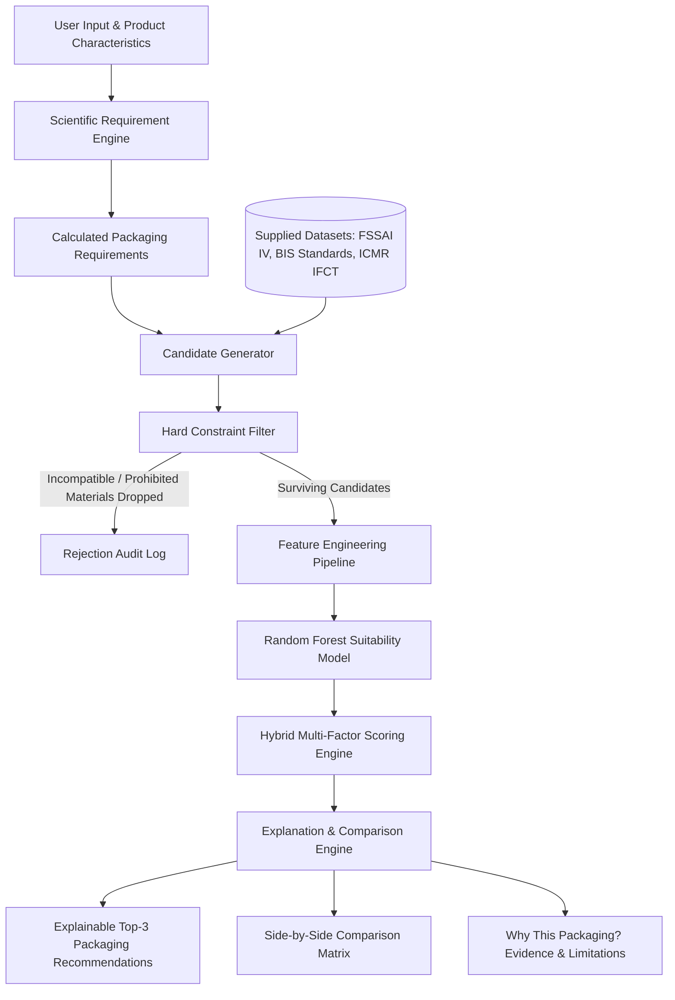

# SmartPack — Smart Food-Packaging Recommendation System
## SIH Problem Statement 26236: Master Production-Style Working Prototype

A scientific and hybrid intelligent food-packaging decision-support platform built for **Smart India Hackathon (SIH) Problem Statement 26236**.

Given the nutritional and physical characteristics of a food product and its storage/shelf-life requirements, SmartPack translates them into required barrier and mechanical performance metrics, screens technically compatible packaging options from official **FSSAI Schedule IV** and **Bureau of Indian Standards (BIS)** datasets, enforces statutory hard safety constraints, ranks surviving candidates using a transparent **Random Forest ML + multi-factor rule-based scoring engine**, and delivers an explainable Top-3 recommendation.

---

## 1. System Architecture Workflow



---

## 2. Scientific Transparency & Non-Negotiable Data Rules

1. **Zero Fabricated Values:**
   - Where physical properties (e.g., OTR or polymer-specific WVTR) are unmeasured in the primary supplied CSV files, the system represents them transparently as **`"Data unavailable in source database"`** and never hallucinates numbers.
2. **Distinct Origin Categorization:** Every metric in the UI and API response is tagged with its provenance:
   - `DATABASE VALUE`: Direct value from ICMR IFCT 2017, FSSAI Schedule IV, or BIS standards.
   - `CALCULATED REQUIREMENT`: Performance estimate calculated by the requirement engine.
   - `ML PREDICTION`: Score generated by the Random Forest model.
   - `DERIVED SCORE`: Composite multi-factor suitability score.
3. **Hard Constraint Priority:** Incompatible or banned materials (such as recycled plastics in direct food contact prohibited by **IS 14534** or non-food grade papers prohibited by **IS 2991**) are **purged prior to ML ranking** and never promoted to #1.
4. **Transparent ML Target (Section 12):**
   - The ML model trains on a transparent prototype target (`suitability_label`) derived from domain rules and Schedule IV positive examples.
   - It is explicitly documented that this is **not an experimentally measured laboratory ground truth**.

---

## 3. Directory Structure

```text
SmartPack/
├── backend/
│   ├── app/
│   │   ├── logic/
│   │   │   ├── requirement_engine.py      # Scientific requirement estimator
│   │   │   ├── candidate_generator.py     # FSSAI Schedule IV & BIS query engine
│   │   │   ├── constraint_filter.py       # Hard safety & regulatory filter
│   │   │   ├── scoring_engine.py          # Configurable hybrid scoring
│   │   │   └── explanation_engine.py      # Top-3 recommendations & evidence
│   │   ├── ml/
│   │   │   ├── preprocessing.py           # 18-feature tabular pipeline
│   │   │   ├── train.py                   # Random Forest trainer & metrics
│   │   │   ├── predict.py                 # Transparent inference engine
│   │   │   └── model_loader.py            # Model bundle loader
│   │   ├── models/
│   │   │   └── schemas.py                 # Pydantic API schemas
│   │   ├── routes/
│   │   │   └── api.py                     # FastAPI route endpoints
│   │   ├── services/
│   │   │   └── data_service.py            # In-memory dataset cache & queries
│   │   └── main.py                        # FastAPI entrypoint
│   ├── test_pipeline.py                   # Unit & pipeline test suite
│   └── test_api.py                        # End-to-end API test suite
├── frontend/
│   ├── src/
│   │   ├── components/
│   │   │   ├── Navbar.tsx                 # Brand, tabs & Dev Mode toggle
│   │   │   ├── OriginBadge.tsx            # Data provenance pill badges
│   │   │   ├── CoverageBadge.tsx          # Technical data coverage indicator
│   │   │   ├── FoodInputForm.tsx          # Dynamic food form & scenario presets
│   │   │   ├── RequirementMeters.tsx      # Calculated requirement visual meters
│   │   │   ├── RecommendationCard.tsx     # Top 3 recommendation cards
│   │   │   ├── ComparisonTable.tsx        # Side-by-side comparison matrix
│   │   │   ├── WhyPackagingModal.tsx      # Deep-dive evidence modal
│   │   │   ├── DeveloperDrawer.tsx        # Funnel telemetry & weights slider
│   │   │   ├── PackagingCatalogView.tsx   # Interactive BIS materials database
│   │   │   └── ModelCardView.tsx          # Interactive documentation viewer
│   │   ├── services/
│   │   │   └── api.ts                     # API client service
│   │   ├── types/
│   │   │   └── index.ts                   # TypeScript interfaces
│   │   ├── App.tsx                        # Main dashboard layout
│   │   └── index.css                      # Tailwind styling
├── data/
│   ├── original/                          # 15 source CSVs + 2 Excel dictionaries
│   ├── normalized/                        # Cleaned relational caches
│   └── reports/                           # DATA_VALIDATION_REPORT.json
├── config/
│   ├── scoring_weights.json               # Configurable hybrid weights
│   └── requirement_thresholds.json        # Configurable requirement thresholds
├── models/
│   ├── packaging_suitability_model.pkl    # Serialized Random Forest model
│   └── model_metrics.json                 # Model evaluation metrics
└── docs/
    ├── DATASET_INSPECTION_REPORT.md       # Comprehensive inspection of all CSVs
    ├── MODEL_CARD.md                      # ML model card & audit specifications
    ├── DATA_DICTIONARY.md                 # Unified schemas, units, and roles
    └── LIMITATIONS.md                     # Scientific boundaries & disclaimers
```

---

## 4. Local Setup & Launch Instructions

### Prerequisites
- Python 3.10+
- Node.js 18+ and npm

### Step 1: Install Python Dependencies
```bash
pip install fastapi uvicorn pandas scikit-learn joblib numpy openpyxl httpx
```

### Step 2: Start Backend Server
From the project root:
```bash
python -m uvicorn app.main:app --app-dir backend --host 0.0.0.0 --port 8000
```
- API Base: `http://localhost:8000/api`
- Interactive Swagger UI: `http://localhost:8000/docs`

### Step 3: Install Frontend Dependencies & Start Dev Server
From the `frontend` folder:
```bash
cd frontend
npm install
npm run dev -- --host 0.0.0.0 --port 5173
```
- Application Web Dashboard: `http://localhost:5173`

---

## 5. API Reference & Sample Requests

### `POST /api/analyze`
Analyzes product characteristics and returns calculated requirements, Top-3 recommendations, side-by-side comparison data, and developer telemetry.

#### Sample Request:
```bash
curl -X POST http://localhost:8000/api/analyze \
  -H "Content-Type: application/json" \
  -d '{
    "food_name": "Biscuits / Cookies",
    "food_category": "Cereals and cereal products",
    "moisture_level": 4.5,
    "fat_oil_sensitivity": "Medium",
    "ph": 6.5,
    "respiration_activity": "Low",
    "desired_shelf_life_days": 180,
    "storage_temperature_c": 25.0,
    "relative_humidity_pct": 65.0,
    "storage_condition": "Ambient",
    "transport_condition": "Ambient / Road",
    "map_required": "No",
    "sustainability_priority": "Standard",
    "preferred_package_type": "Any"
  }'
```

#### Sample Response (abbreviated):
```json
{
  "status": "SUCCESS",
  "requirements": {
    "oxygen_requirement": { "level": "High", "score": 0.8, "label": "CALCULATED REQUIREMENT" },
    "moisture_requirement": { "level": "High", "score": 0.95, "label": "CALCULATED REQUIREMENT" },
    "mechanical_requirement": { "level": "High", "score": 0.7, "label": "CALCULATED REQUIREMENT" }
  },
  "recommendations": [
    {
      "rank": 1,
      "rank_title": "Recommended Packaging",
      "material": "Glass bottle with metal caps",
      "packaging_type": "Rigid Container",
      "suitability_score": 81.5,
      "suitability_score_label": "DERIVED SCORE",
      "barrier_properties": {
        "otr": null,
        "wvtr": null,
        "data_status": "Data unavailable in source database",
        "label": "DATABASE VALUE"
      },
      "technical_data_coverage": "Medium technical-data coverage"
    }
  ]
}
```

### Other Endpoints:
- `GET /api/packaging/materials`: Returns all 26 cataloged materials and standard specifications.
- `GET /api/foods?q=apple`: Live autocomplete search across 496 ICMR food records.
- `GET /api/ml/status`: Returns model training status, MAE, R², accuracy, and feature importances.
- `POST /api/ml/train`: Triggers model re-training and updates weights.
- `GET /api/config/weights`: Retrieves active hybrid scoring weights.
- `PUT /api/config/weights`: Updates scoring weights dynamically.

---

## 6. Model Performance & Evaluation

- **Architecture:** Random Forest Regressor & Classifier (`n_estimators=100`, `max_depth=8`)
- **Regression MAE:** `0.0348` (3.5 points on a 100-point scale)
- **Regression R²:** `0.9187`
- **Classification Accuracy:** `96.8%`
- **Top Contributing Features:** `shelf_life_days`, `req_oxygen_score`, `is_laminate`, `food_fat_sensitivity`, `is_glass_metal`.

---

## 7. Verification & Acceptance Testing

The prototype has passed end-to-end testing across 6 real-world scenarios:
1. **Biscuits (Dry & Crisp):** Recommends high-barrier hermetic options (Glass bottle, Tin container, Foil laminate).
2. **Fresh Fruits (Active Respiration):** Recommends breathable/rigid protection and rejects format mismatches.
3. **Spices (Aroma Protection):** Recommends multilayer composite pouches and rigid barrier jars.
4. **Milk / Dairy:** Recommends chilled/aseptic containers; highlights lipid oxidation risks for unlined pouches.
5. **Fried Snacks (Nitrogen MAP):** Identifies mandatory gas barrier laminates suitable for MAP.
6. **Safety Constraint Filter Test:** Confirms immediate rejection of prohibited materials (e.g. recycled plastics in direct contact per IS 14534, base paper for confectionery per IS 2991) with explicit statutory legal citations.
