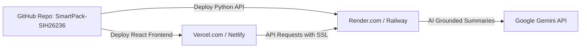

# SmartPack Deployment Guide (SIH 26236)

This document provides step-by-step instructions to deploy SmartPack online to public production hosting.

---

## Architecture Overview



---

## Method 1 (Recommended & Free): Render (Backend) + Vercel (Frontend)

### Part A: Deploy Python Backend to Render (Free)
1. Go to [dashboard.render.com](https://dashboard.render.com/) and log in with your GitHub account.
2. Click **New +** $\to$ **Web Service**.
3. Under **Connect a repository**, select `Tharnikaa/SmartPack-SIH26236`.
4. Configure the settings:
   - **Name:** `smartpack-api`
   - **Region:** `Singapore` (or nearest region)
   - **Branch:** `main`
   - **Root Directory:** *(leave blank)*
   - **Runtime:** `Python 3`
   - **Build Command:** `pip install -r requirements.txt`
   - **Start Command:** `uvicorn app.main:app --app-dir backend --host 0.0.0.0 --port $PORT`
   - **Plan:** `Free`
5. Click **Advanced** $\to$ **Add Environment Variable**:
   - `GEMINI_API_KEY`: *(paste your Gemini API key)*
   - `PYTHON_VERSION`: `3.12.0`
6. Click **Create Web Service**.
7. Wait 2-3 minutes. When live, test in browser:
   `https://smartpack-api.onrender.com/api/health`

---

### Part B: Deploy React Frontend to Vercel (Free)
1. Go to [vercel.com](https://vercel.com/) and log in with GitHub.
2. Click **Add New...** $\to$ **Project**.
3. Import `Tharnikaa/SmartPack-SIH26236`.
4. Configure the project:
   - **Framework Preset:** `Vite`
   - **Root Directory:** Click "Edit" and choose: `frontend`
   - **Build Command:** `npm run build`
   - **Output Directory:** `dist`
5. Under **Environment Variables**, add:
   - **Name:** `VITE_API_BASE_URL`
   - **Value:** `https://smartpack-api.onrender.com/api` *(Your Render URL from Part A)*
6. Click **Deploy**.
7. Done! Your website will be live worldwide with SSL (HTTPS) enabled.

---

## Method 2: Docker Container Deployment

A self-contained Dockerfile can also be used for AWS App Runner, Google Cloud Run, or DigitalOcean:

```dockerfile
FROM node:20-alpine AS frontend-builder
WORKDIR /app/frontend
COPY frontend/package*.json ./
RUN npm install
COPY frontend/ ./
RUN npm run build

FROM python:3.12-slim
WORKDIR /app
COPY requirements.txt .
RUN pip install --no-cache-dir -r requirements.txt
COPY . .
COPY --from=frontend-builder /app/frontend/dist /app/frontend/dist

EXPOSE 8000
CMD ["uvicorn", "app.main:app", "--app-dir", "backend", "--host", "0.0.0.0", "--port", "8000"]
```
